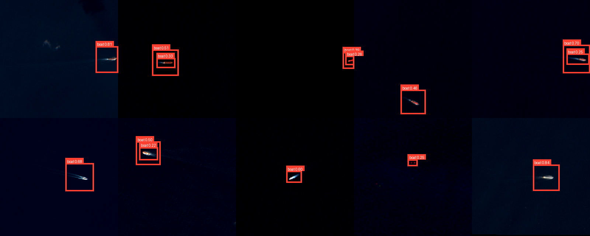

# Vessel Detection

Gradio Space for detecting vessels in satellite imagery with a fine-tuned YOLOv8 model.

The main demo example is a multi-vessel satellite patch with 14 detections at the default confidence threshold.

## Links

- Live Space: https://huggingface.co/spaces/DefendIntelligence/vessel-detection
- Model repository: https://huggingface.co/DefendIntelligence/vessel-detection
- Direct model download: https://huggingface.co/DefendIntelligence/vessel-detection/resolve/main/models/best.pt

## Model

- Local file expected by the app: `models/best.pt`
- Checkpoint source: `train-20260417T124314Z-fad9d3ed_best.pt`
- Run source: `infer-b88a2887`
- Training name: `super-visible-y8s-newlabels-focuslite-e45`
- Family: YOLOv8s
- Main dataset: `sentinel-2-rgb`
- Local index mAP50: `0.7912`

The GitHub repository does not store `best.pt`. Use the bootstrap command below and it will download the model from Hugging Face.

## Run Locally

```bash
git clone https://github.com/anisayari/vessel-detection.git
cd vessel-detection
python run_local.py
```

Windows shortcut:

```powershell
.\start.ps1
```

macOS/Linux shortcut:

```bash
bash start.sh
```

The script creates a local `.venv`, installs `requirements.txt`, downloads `models/best.pt` from Hugging Face, then starts Gradio at `http://127.0.0.1:7860`.

Useful options:

```bash
python run_local.py --download-only
python run_local.py --skip-install
python run_local.py --host 0.0.0.0 --port 7860
```

## Use The App

1. Upload an RGB satellite image or select an example.
2. Adjust the confidence threshold if needed.
3. Click `Detect vessels`.

The app tiles large images before inference so small vessels remain visible to the model.

## Hugging Face Deployment

```bash
git init
git lfs install
git remote add origin https://huggingface.co/spaces/DefendIntelligence/vessel-detection
git add .
git commit -m "Add YOLOv8 satellite boat detector Space"
git push -u origin main
```

If the Space already exists, clone it and copy this folder's contents to the Space repository root.
